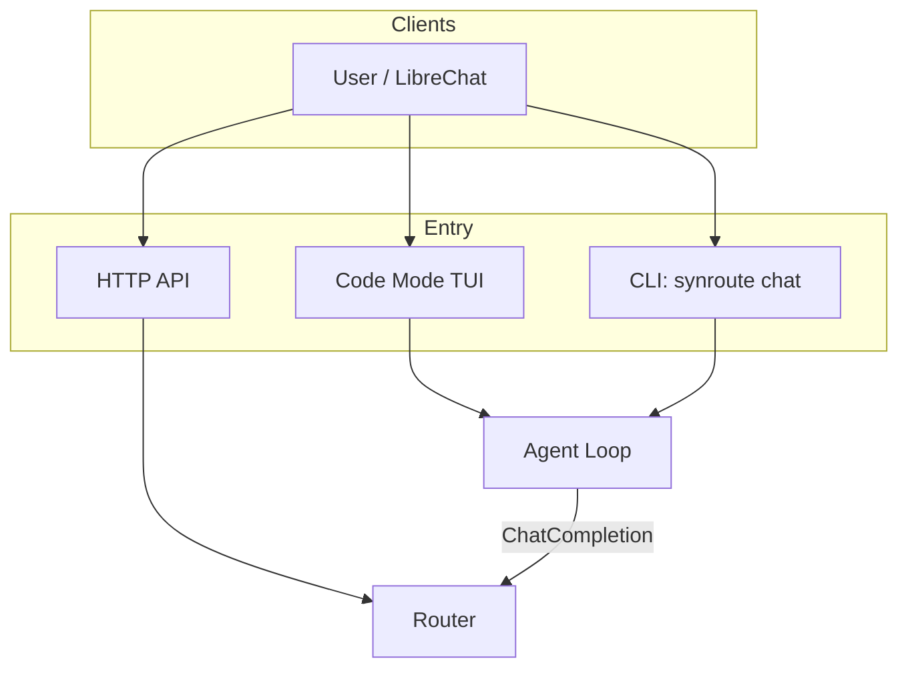
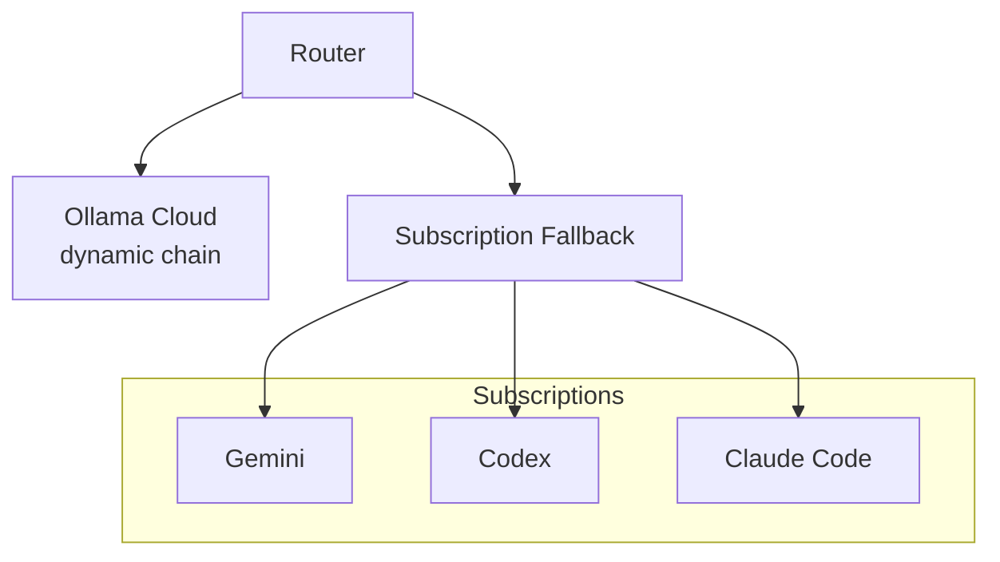
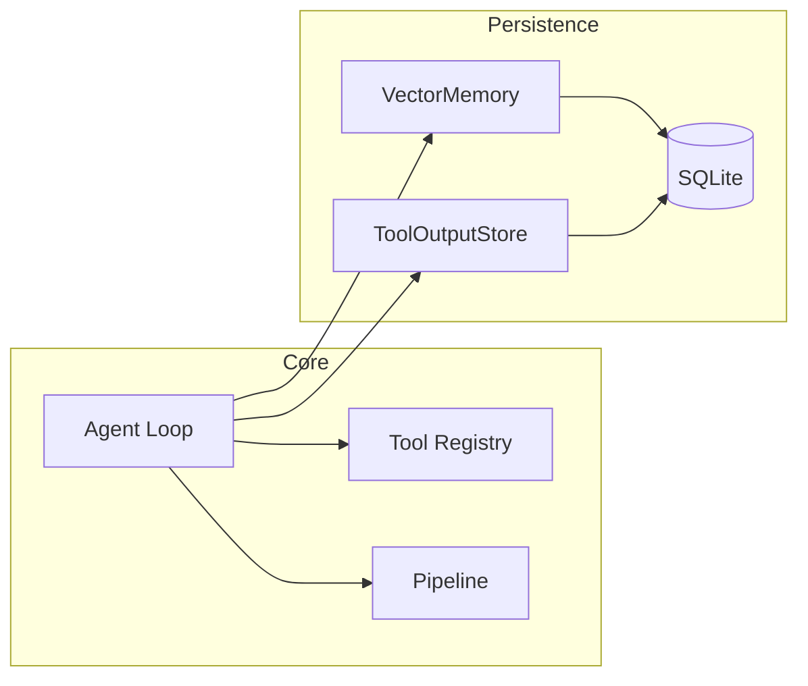
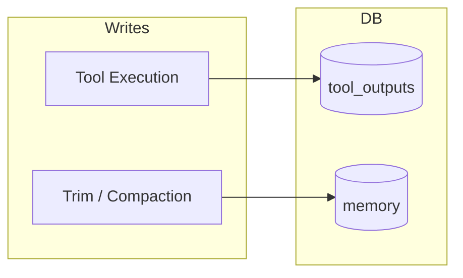
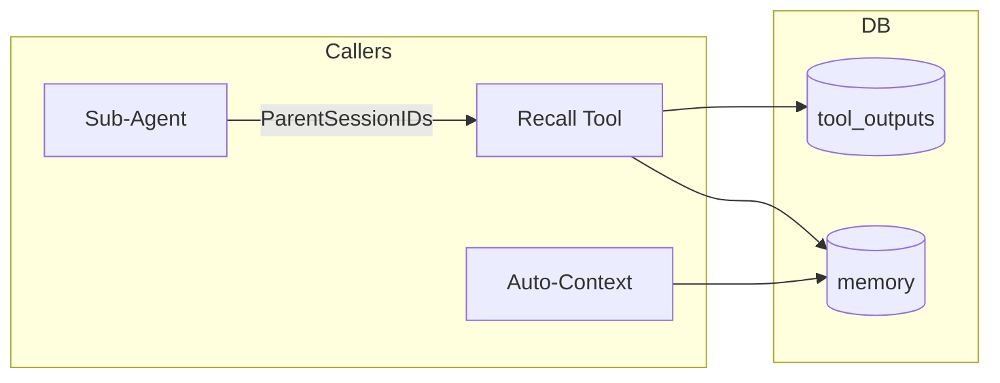

# Architecture Overview

Synapserouter is a Go-based LLM proxy router and coding agent. It distributes requests across multiple providers (Ollama Cloud primary, subscription providers as fallback, Vertex AI for work profile, optional models.corp), includes a code mode TUI and interactive agent with 10 built-in tools + 2 agent tools, token streaming via SSE, and provides an OpenAI-compatible API.

## Core Components

### Entry Points



### Router and Providers



### Agent Internals



## Provider Chains

### Personal Profile

Dynamic Ollama Cloud escalation chain configured via `OLLAMA_CHAIN` env var:

```
OLLAMA_CHAIN format: level0_models|level1_models|level2_models|...
  - Pipe (|) separates escalation levels
  - Comma (,) separates models within a level (round-robin)
  - After all Ollama levels: subscription fallback (gemini > codex > claude-code)
```

The number of levels, models per level, and model selection are fully user-configurable.
Default conversation tier: `frontier` (configurable via `SYNROUTE_CONVERSATION_TIER`).

### Work Profile

3-tier Vertex AI chain (haiku → sonnet+gemini → opus+gemini), configurable via `WORK_CHAIN` env var (same pipe-separated format). Optional `models.corp` OpenAI-compatible provider via `MODELS_CORP_BASE_URL`.
Default conversation tier: `mid` (configurable via `SYNROUTE_CONVERSATION_TIER`).

## Memory System (Unlimited Context)

See [[Memory System]] for full details.

### Storage Path



### Retrieval Path



**Key design:** Zero information loss. Every message and tool output reaches the DB before being dropped from conversation. See [[Memory System#Loss Points Fixed]].

## Agent Pipeline

See [[Agent Pipeline]] for full details.

```
plan > implement > self-check > code-review > acceptance-test
```

- Quality gates at each phase transition (minimum tool calls required)
- Sub-agents for review (fresh context, independent evaluation)
- Escalate: true on code-review and acceptance-test (forces bigger model)
- Dynamic turn caps: 15 (simple spec), 25 (medium), 40 (complex >20KB)
- Review cycle divergence detection via `ReviewStabilityTracker` (force-advance when findings increase)
- Regression tracking via `RegressionTracker` (compilation error count monitoring)
- Loop/stall detection in all modes (not just pipeline)
- Completion signal detection (prevents infinite loops)
- Text-based tool call parser (5 formats for Ollama models without native function calling)
- Response truncation at 4000 chars (prevents training data leakage)
- Budget exhaustion escalation (sub-agents trigger parent provider change)
- Provider escalation between phases

## Skill System

54 embedded skills parsed from YAML frontmatter in `.md` files via `go:embed`. 13 high-risk skills include spec-deferral headers.

| Category | Skills |
|----------|--------|
| Go | go-patterns, go-testing |
| Python | python-patterns, python-testing, python-venv |
| Java | java-patterns, java-testing, java-spring |
| TypeScript | typescript-patterns, typescript-testing |
| Swift | swift-patterns, swift-testing |
| Kotlin | kotlin-patterns, kotlin-testing |
| Rust | rust-patterns, rust-testing |
| C# | csharp-patterns, csharp-testing |
| JavaScript | javascript-patterns, node-toolchain |
| Infrastructure | docker-expert, devops-engineer, api-design, sql-expert |
| Quality | code-review, security-review, code-implement |
| Research | research, deep-research, search-first |
| Other | 15+ more (dbt, snowflake, git, github, spec, etc.) |

Skills fire by trigger matching with compound support (`go+handler` requires both words).
See [[Skill System]].

## Hallucination Detection

See [[Hallucination Detection]] for full details.

- **FactTracker** -- accumulates ground truth from tool outputs (paths, exit codes, test results)
- **HallucinationChecker** -- 5 pattern-based rules, <1ms, no LLM calls
- **AutoRecall** -- retrieves contradicting evidence, injects corrective message
- Rate limited at 3 corrections per session
- All corrective messages pass through `scrubSecrets()`

## Key Files

| File | Purpose |
|------|---------|
| `main.go` | Server, routes, provider init |
| `commands.go` | CLI dispatch |
| `diagnostic_handlers.go` | Agent API handler |
| `internal/agent/agent.go` | Agent loop, tool execution, pipeline |
| `internal/agent/coderepl.go` | Code mode REPL with keyboard shortcuts |
| `internal/agent/coderenderer.go` | Code mode TUI rendering |
| `internal/agent/text_tool_parser.go` | Text-based tool call parsing (5 formats) |
| `internal/agent/attachment.go` | File attachment (@file, @dir/) parsing |
| `internal/agent/terminal.go` | Raw terminal mode (uses os.Stdin, not os.NewFile) |
| `internal/tools/web_search.go` | Web search (DuckDuckGo, Tavily, SearXNG) |
| `internal/tools/web_fetch.go` | Web fetch (SSRF-safe) |
| `internal/tools/notebook_edit.go` | Jupyter notebook editing by cell index |
| `internal/tools/safeclient.go` | SSRF-safe HTTP client |
| `internal/agent/conversation.go` | Message management, trim hooks |
| `internal/agent/unified_recall.go` | Cross-store, cross-session search |
| `internal/agent/fact_tracker.go` | Ground truth accumulation |
| `internal/agent/hallucination.go` | Detection rules |
| `internal/router/router.go` | Provider selection, memory injection |
| `internal/memory/vector.go` | VectorMemory, embedding search |
| `internal/orchestration/skills.go` | Skill registry, trigger matching |
