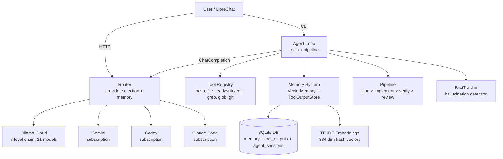
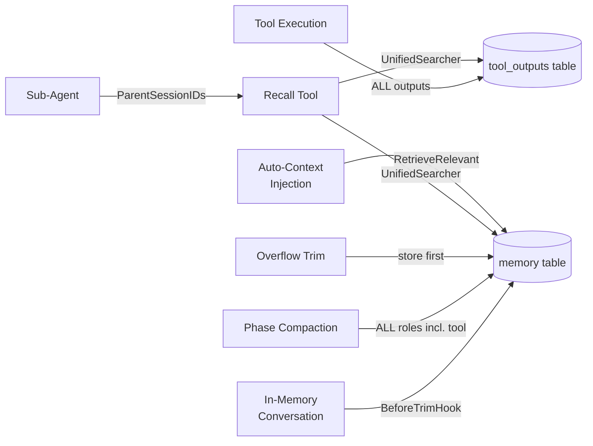

# Architecture Overview

Synapserouter is a Go-based LLM proxy router and coding agent. It distributes requests across multiple providers (Ollama Cloud primary, subscription providers as fallback), includes an interactive agent with tool execution, and provides an OpenAI-compatible API.

## Core Components



## Provider Chain (Personal Profile)

7-level Ollama Cloud escalation with 19+ models:

| Level | Models | Purpose |
|-------|--------|---------|
| L0 | ministral-3:14b, rnj-1:8b, nemotron-3-nano:30b | Fast/cheap |
| L1 | gpt-oss:20b, devstral-small-2:24b, qwen3.5 | Small coders |
| L2 | nemotron-3-super, gpt-oss:120b, minimax-m2.7 | Medium |
| L3 | devstral-2:123b, qwen3-coder:480b | Large coders |
| L4 | qwen3.5:397b, kimi-k2.5, minimax-m2.5 | XL general |
| L5 | deepseek-v3.1:671b, cogito-2.1:671b | XXL reasoning |
| L6 | glm-5, kimi-k2-thinking, glm-4.7 | Frontier |
| Fallback | gemini > codex > claude-code | Subscription |

## Memory System (Unlimited Context)

See [[Memory System]] for full details.



**Key design:** Zero information loss. Every message and tool output reaches the DB before being dropped from conversation. See [[Memory System#Loss Points Fixed]].

## Agent Pipeline

See [[Agent Pipeline]] for full details.

```
plan > implement > self-check > code-review > acceptance-test
```

- Quality gates at each phase transition
- Sub-agents for review (fresh context, independent evaluation)
- Review cycle stability detection (stops after 2 unchanged cycles)
- Provider escalation between phases

## Skill System

52 embedded skills parsed from YAML frontmatter in `.md` files via `go:embed`.

| Category | Skills |
|----------|--------|
| Go | go-patterns, go-testing |
| Python | python-patterns, python-testing, python-venv |
| Java | java-patterns, java-testing, java-spring |
| TypeScript | typescript-patterns, typescript-testing |
| Swift | swift-patterns, swift-testing |
| Kotlin | kotlin-patterns, kotlin-testing |
| Rust | rust-patterns, rust-testing |
| C# | csharp-patterns, csharp-testing |
| JavaScript | javascript-patterns, node-toolchain |
| Infrastructure | docker-expert, devops-engineer, api-design, sql-expert |
| Quality | code-review, security-review, code-implement |
| Research | research, deep-research, search-first |
| Other | 15+ more (dbt, snowflake, git, github, spec, etc.) |

Skills fire by trigger matching with compound support (`go+handler` requires both words).
See [[Skill System]].

## Hallucination Detection

See [[Hallucination Detection]] for full details.

- **FactTracker** — accumulates ground truth from tool outputs (paths, exit codes, test results)
- **HallucinationChecker** — 5 pattern-based rules, <1ms, no LLM calls
- **AutoRecall** — retrieves contradicting evidence, injects corrective message
- Rate limited at 3 corrections per session
- All corrective messages pass through `scrubSecrets()`

## Key Files

| File | Purpose |
|------|---------|
| `main.go` | Server, routes, provider init |
| `commands.go` | CLI dispatch |
| `diagnostic_handlers.go` | Agent API handler |
| `internal/agent/agent.go` | Agent loop, tool execution, pipeline |
| `internal/agent/conversation.go` | Message management, trim hooks |
| `internal/agent/unified_recall.go` | Cross-store, cross-session search |
| `internal/agent/fact_tracker.go` | Ground truth accumulation |
| `internal/agent/hallucination.go` | Detection rules |
| `internal/router/router.go` | Provider selection, memory injection |
| `internal/memory/vector.go` | VectorMemory, embedding search |
| `internal/orchestration/skills.go` | Skill registry, trigger matching |
