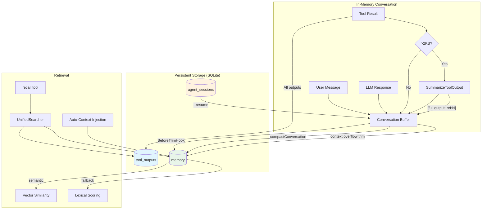

# Memory System

The memory system gives the agent persistent, searchable memory across conversation turns and sessions. It solves the fundamental problem of in-memory conversation being finite (200-500 messages) while agent sessions can run thousands of turns across multiple pipeline phases.

Three subsystems work together: **VectorMemory** stores compacted conversation with embeddings for semantic search, **ToolOutputStore** preserves full tool outputs while conversation gets summaries, and **UnifiedSearcher** merges both into a single recall interface.

## Data Flow



## Storage Layer

### Three Tables

| Table | Purpose | Key Columns | Populated By |
|---|---|---|---|
| `memory` | Compacted conversation messages with embeddings | `content`, `embedding` (BLOB), `session_id`, `role`, `metadata` | `BeforeTrimHook`, `compactConversation`, `storeMessagesToDB` |
| `tool_outputs` | Full tool output preserved when conversation gets summaries | `tool_name`, `args_summary`, `summary`, `full_output`, `exit_code` | `executeToolCalls` (all outputs, regardless of size) |
| `agent_sessions` | Serialized agent state for `--resume` | `session_id`, `model`, `messages` (JSON), `work_dir` | `SaveState` / `LoadState` |

### memory Table

Defined in `migrations/001_init.sql`. Each row is a single message (user, assistant, or tool) with an optional vector embedding. Indexed on `session_id` and `timestamp`.

```sql
CREATE TABLE memory (
    id INTEGER PRIMARY KEY AUTOINCREMENT,
    content TEXT NOT NULL,
    embedding BLOB,              -- float32[] encoded as little-endian bytes
    timestamp DATETIME DEFAULT CURRENT_TIMESTAMP,
    session_id TEXT,
    role TEXT,                   -- user | assistant | tool
    metadata TEXT                -- JSON: {source, tool_call_id, ...}
);
```

### tool_outputs Table

Defined in `migrations/007_tool_outputs.sql`. Auto-created by `NewToolOutputStore` if the migration hasn't run. Every tool execution is stored here -- even small outputs -- ensuring zero information loss.

```sql
CREATE TABLE tool_outputs (
    id INTEGER PRIMARY KEY AUTOINCREMENT,
    session_id TEXT NOT NULL,
    tool_name TEXT NOT NULL,
    args_summary TEXT,           -- e.g. "path=/src/main.go"
    summary TEXT NOT NULL,       -- concise summary for listing
    full_output TEXT,            -- complete output, secrets scrubbed
    exit_code INTEGER DEFAULT 0,
    output_size INTEGER DEFAULT 0,
    created_at DATETIME DEFAULT CURRENT_TIMESTAMP
);
```

### agent_sessions Table

Defined in `migrations/006_agent_sessions.sql`. Stores serialized conversation for `synroute chat --resume`.

```sql
CREATE TABLE agent_sessions (
    session_id TEXT PRIMARY KEY,
    model TEXT NOT NULL DEFAULT 'auto',
    system_prompt TEXT NOT NULL DEFAULT '',
    work_dir TEXT NOT NULL DEFAULT '.',
    messages TEXT NOT NULL DEFAULT '[]',   -- JSON-serialized providers.Message[]
    created_at DATETIME DEFAULT CURRENT_TIMESTAMP,
    updated_at DATETIME DEFAULT CURRENT_TIMESTAMP
);
```

## Tool Output Summarization

When a tool produces output, two things happen in `executeToolCalls`:

1. **Full output stored in DB** via `ToolOutputStore.Store()` -- always, regardless of size. Secrets are scrubbed via `scrubSecrets()` before storage.
2. **Conversation gets a summary** if output exceeds 2KB (`summarizeThreshold`). The summary includes a `[full output: ref:N]` back-reference so the agent can recall it later.

```
Tool output (e.g., 50KB grep result)
    |
    +--> DB: full 50KB stored in tool_outputs (scrubbed)
    |
    +--> Conversation: "grep found 142 matches in 38 files.
         First 5: ... Last 5: ... [full output: ref:47]"
```

Small outputs (<2KB) are kept verbatim in conversation AND stored in DB. `file_write` and `file_edit` are never re-summarized since they already return concise confirmations.

See `internal/agent/tool_summarize.go` for the `ShouldSummarize` and `SummarizeToolOutput` functions.

## Retrieval: UnifiedSearcher

`UnifiedSearcher` (`internal/agent/unified_recall.go`) wraps both `ToolOutputStore` and `VectorMemory` behind a single interface that the [[Recall Tool]] uses. It searches across multiple sessions (current + all parent sessions).

### Three Retrieval Modes

The `recall` tool supports three modes, dispatched by arguments:

| Mode | Trigger | What It Does |
|---|---|---|
| **Retrieve by ID** | `recall(id=47)` | Fetches full output from `tool_outputs` by ID. Tries current session first, then all parent sessions. |
| **Semantic search** | `recall(query="auth middleware")` | Queries `VectorMemory.RetrieveRelevant` across all sessions. Returns conversation messages ranked by embedding similarity. Also appends matching tool outputs. |
| **Tool output search** | `recall(tool_name="bash")` | Queries `ToolOutputStore.SearchMultiSession` filtered by tool name. Returns summaries with ref IDs. |

### Hybrid Search in VectorMemory

`RetrieveRelevant` (`internal/memory/vector.go`) uses a two-tier search strategy:

1. **Always fetch 4 most recent messages** for immediate conversational continuity.
2. **Supplement with semantic results** up to a token budget (default 4096, max 8192):
   - **Primary**: Vector similarity via cosine distance on embeddings. Minimum similarity threshold of 0.15 filters noise.
   - **Fallback**: Lexical scoring if no embeddings exist. Tokenizes query, scores content by term frequency with exact-match bonus.
3. **Deduplicate** across both result sets using `role + content` as the key.

### Embedding Providers

Two embedding providers are available (`internal/memory/embeddings.go`):

| Provider | Dimensions | When Used | Quality |
|---|---|---|---|
| `LocalHashEmbedding` | 384 | Default (no API key needed) | TF-IDF weighted feature hashing: word unigrams, char 3-grams, word bigrams. Pure Go, zero dependencies. |
| `OpenAIEmbedding` | 1536 | When `OPENAI_API_KEY` is set | `text-embedding-3-small` via API. Results cached in-memory. |

Selection happens automatically in `NewVectorMemoryWithEmbedder`: if `OPENAI_API_KEY` is present, use OpenAI; otherwise fall back to local hashing.

## Compaction

Compaction moves old messages from the in-memory conversation buffer to the database. Three mechanisms trigger it, at different urgency levels:

### 1. BeforeTrimHook (Automatic Trim)

Set up in `setupTrimHook()` at the start of every `Run()`. When conversation exceeds `MaxMessages`, the `Conversation.trim()` method drops old messages from the front -- but first calls `BeforeTrimHook` with the messages about to be dropped. The hook stores each message to `VectorMemory` with its embedding.

Tool-call boundaries are respected: `trim()` never splits an assistant message with `ToolCalls` from its corresponding tool result messages. It skips forward to a clean boundary (user message or plain assistant message).

### 2. Phase Compaction (compactConversation)

Called explicitly between [[Pipeline]] phases in `advancePipeline()`. When conversation exceeds 30 messages:

1. Stores the oldest `N - 20` messages to DB via `storeMessagesToDB`.
2. Clears conversation and rebuilds with a summary marker + the 20 most recent messages.
3. Sets `hasCompacted = true` to enable auto-context injection (see below).

```
Before: [msg1, msg2, ..., msg80, ..., msg100]
After:  ["[Phase X completed. 80 messages compacted to DB.]", msg81, ..., msg100]
```

### 3. Emergency Trim (Context Overflow)

In `callLLMWithRetry`, if the LLM returns a context overflow error (`"too long"`, `"context length"`, etc.):

1. Stores the first 20 messages to DB via `storeMessagesToDB`.
2. Calls `TrimOldest(20)` to drop them from conversation.
3. Rebuilds the message list and retries the LLM call.

The `TrimOldest` method also calls `BeforeTrimHook` before removing messages, ensuring nothing is lost even in emergency scenarios.

## Auto-Context Injection

After any compaction event sets `hasCompacted = true`, the `buildMessages()` method automatically injects retrieved context before the conversation messages:

```
[system prompt]
[user: "[Retrieved context from earlier:]\n[assistant] fixed the auth bug...\n[user] now check the tests..."]
[assistant: "Understood, I have the retrieved context from earlier in the session."]
[...current conversation messages...]
```

The retrieval query is the last user message. Budget is capped at 2048 tokens. This runs on every `buildMessages()` call after compaction, so the agent always has relevant prior context even though the raw messages were dropped.

## Model-Aware MaxMessages

The `modelMaxMessages()` function adjusts how aggressively the conversation is trimmed based on the model's context window:

| Model Family | MaxMessages | Rationale |
|---|---|---|
| Gemini | 500 | 1M+ token context window |
| Claude | 400 | 200K token context window |
| DeepSeek | 300 | 128K token context window |
| Default (Ollama, etc.) | 200 | Conservative for smaller context windows |

Set once at the start of `Run()` via `a.conversation.MaxMessages = modelMaxMessages(a.config.Model)`. The `Conversation.maxMsgs()` method returns whichever is set (model-specific or default 200).

## Cross-Session Recall

### ParentSessionIDs

The `Config.ParentSessionIDs` field carries the lineage of ancestor sessions: `[parent, grandparent, ...]`. When the `recall` tool is registered in `Run()`, it creates a `UnifiedSearcher` with `allSessionIDs = [current, parent, grandparent, ...]`.

This means:
- Sub-agents can recall tool outputs from their parent agent's session.
- Resumed sessions (`--resume`, `--session <id>`) can access prior session data.
- `UnifiedSearcher.Retrieve()` tries the current session first, then walks all parent session IDs until the output is found.

### Memory Entries in Recall Results

When `UnifiedSearcher.Search()` is called without a `toolName` filter, it supplements tool output results with conversation memory entries from `VectorMemory`. These appear as synthetic `ToolOutputResult` entries with:
- `ID = -1` (negative signals memory entry, not tool output)
- `ToolName = "memory:<role>"` (e.g., `memory:assistant`)
- `ArgsSummary = "session=<id>"`

## Related

- [[Pipeline]] -- triggers phase compaction between phases
- [[Agent Loop]] -- `Run()`, `loop()`, `executeToolCalls()`, `buildMessages()`
- [[Recall Tool]] -- LLM-invocable tool for explicit memory queries
- [[Tool Summarization]] -- `ShouldSummarize`, `SummarizeToolOutput`
- [[State Persistence]] -- `SaveState`, `LoadState`, `--resume` flag
- [[Hallucination Detection]] -- uses `FactTracker` ground truth from tool outputs, triggers `autoRecall` for correction

## Source Files

| File | Role |
|---|---|
| `internal/memory/vector.go` | `VectorMemory`: Store, RetrieveRelevant, RetrieveRecent, hybrid search |
| `internal/memory/embeddings.go` | `LocalHashEmbedding`, `OpenAIEmbedding`, cosine similarity |
| `internal/agent/tool_store.go` | `ToolOutputStore`: Store, Retrieve, Search, SearchMultiSession |
| `internal/agent/unified_recall.go` | `UnifiedSearcher`: unified search across tool outputs + memory |
| `internal/agent/conversation.go` | `Conversation`: MaxMessages, BeforeTrimHook, TrimOldest, trim |
| `internal/agent/agent.go` | `compactConversation`, `storeMessagesToDB`, `setupTrimHook`, `buildMessages`, `modelMaxMessages` |
| `internal/agent/config.go` | `Config.VectorMemory`, `Config.ToolStore`, `Config.ParentSessionIDs` |
| `internal/agent/tool_summarize.go` | `ShouldSummarize`, `SummarizeToolOutput`, `scrubSecrets` |
| `internal/tools/recall.go` | `RecallTool`: 3-mode recall (by ID, semantic, tool search) |
| `migrations/001_init.sql` | `memory` table schema |
| `migrations/006_agent_sessions.sql` | `agent_sessions` table schema |
| `migrations/007_tool_outputs.sql` | `tool_outputs` table schema |
